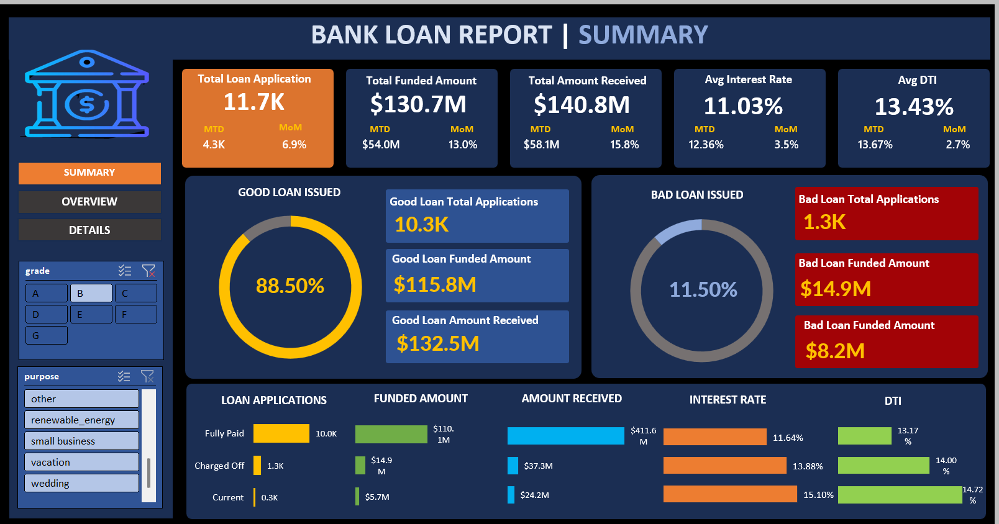
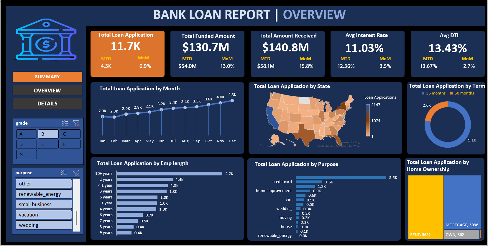

# 📊 Bank Loan Analysis Dashboard

An **interactive dashboard built in Excel** using the *Financial Loan Dataset* to analyze loan applications, funded amounts, repayments, and borrower profiles.

## 🔹 Project Overview

This project focuses on analyzing and visualizing financial loan data. Using Excel, I created an interactive dashboard that provides meaningful insights into loan performance, repayment trends, and borrower characteristics.

## 🔹 Features

* ✅ **KPIs Tracked:**

  * Total Loan Applications
  * Total Funded Amount
  * Total Amount Received
  * Average Interest Rate
  * Debt-to-Income Ratio (DTI)

* ✅ **Insights Provided:**

  * Month-on-Month (MoM) & Month-to-Date (MTD) analysis
  * Good Loan vs Bad Loan segmentation
  * Loan applications by **State, Purpose, Term, Grade, and Home Ownership**
  * Borrower profile analysis (including employee length)
  * Loan funding and repayment trends

## 🔹 Tools & Techniques Used

* Microsoft Excel
* Pivot Tables & Pivot Charts
* Data Cleaning & Transformation
* Interactive Filters & Slicers
* KPI Tracking (MoM & MTD calculations)

## 🔹 Dashboard Preview

## 🔹 Key Takeaways

* Strengthened **data visualization and storytelling skills**
* Learned to track **financial KPIs** effectively
* Improved ability to build **interactive dashboards** with slicers & filters
* Understood how data helps identify **loan risks and growth opportunities**

## 🔹 How to Use

1. Clone or download this repository.
2. Open the Excel file `Book1.xlsx`.
3. Navigate through the dashboard using **slicers and filters**.

✨ *This project demonstrates my skills in data analytics, financial reporting, and dashboard design using Excel.*

👉 Do you want me to also add a **“Future Improvements” section** (like adding Power BI version or automation) to show recruiters you plan to enhance it further?

